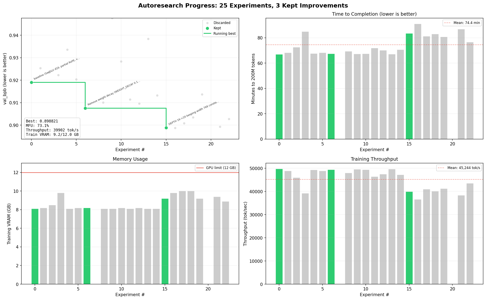

# TrainRTX5070_200MTokens

> Autonomous LLM pretraining research on a single RTX 5070. Token-based evaluation with WSD schedule and muP.



*AI agent runs experiments autonomously: modify code, train for 200M tokens, check if val_bpb improved, keep or discard, repeat. You sleep, it researches.*

## What's different from the 60-minute version?

This project redesigns the autoresearch loop so that 1-hour findings **scale to 1-month runs**:

1. **Token-based stopping (200M tokens)** — Measures val_bpb at a fixed compute milestone instead of fixed wall-clock time. Architectures that are slower per step but more compute-efficient are properly rewarded.
2. **WSD learning rate schedule** — Warmup (5%) + Stable (95%), no decay. Measures learning trajectory slope during pure exploration, not how fast a model settles into a local minimum.
3. **muP (Maximal Update Parameterization)** — Learning rates and initialization scale with model width (reference: 768). Hyperparameters transfer automatically across model sizes.

## Start the AI agent

```
Read @program.md and @CLAUDE.md. Continue the experiment loop on the autoresearch/<tag> branch. The baseline is already recorded in results.tsv. Start experimenting. Remember to git pull first and do a landscape scan web search before your first experiment.
```

Paste this into Claude Code (with bypass permissions on). Monitor in two PowerShell windows:

```powershell
# Window 1 — training steps (pick one)
Get-Content run.log -Tail 3 -Wait                                          # scrolling
while ($true) { Clear-Host; Get-Content run.log -Tail 5; Start-Sleep 5 }   # fixed dashboard

# Window 2 — experiment results (pick one)
Get-Content results.tsv -Tail 10 -Wait                                          # scrolling
while ($true) { Clear-Host; Get-Content results.tsv -Tail 10; Start-Sleep 30 }  # fixed dashboard
```

## How it works

The AI agent loops forever: change code, train for 200M tokens, measure val_bpb (bits per byte), keep if improved, discard if not. Each experiment is logged in `results.tsv` with full metrics (val_bpb, MFU, throughput, VRAM, model size, wall-clock time). The progress chart updates automatically.

| Component | Details |
|-----------|---------|
| GPU | RTX 5070 12GB (Blackwell CC 12.0, ~66 TFLOPS BF16) |
| Model | SwiGLU MLP, partial RoPE, value embeddings, ~200M params (AI evolves this) |
| Dataset | ClimbMix (nvidia/Nemotron-ClimbMix), GPT-2 tokenizer |
| Optimizer | Muon (matrices) + AdamW (embeddings) |
| Parameterization | muP (base width 768, scale-invariant hyperparameters) |
| LR schedule | WSD: 5% warmup + 95% stable (no decay for experiments) |
| Token budget | 200M tokens per experiment (~50 min on RTX 5070) |
| Metric | val_bpb — lower is better |

## Project structure

```
train.py        — model + training loop (AI modifies this)
prepare.py      — data pipeline, tokenizer, evaluation (fairness-locked)
program.md      — experiment loop protocol (AI follows this)
CLAUDE.md       — project context + rules for AI agents
results.tsv     — experiment log (all metrics, all experiments)
ideas.tsv       — scratch queue of untried experiment ideas
plot_results.py — generates progress.png (experiment progress chart)
```

## Setup from scratch

Requirements: RTX 5070, Windows, Python 3.10+, [uv](https://docs.astral.sh/uv/).

```powershell
# Install uv (if needed)
powershell -ExecutionPolicy ByPass -c "irm https://astral.sh/uv/install.ps1 | iex"

# Install dependencies
uv sync

# Download ClimbMix data (~6GB, parallel download)
uv run prepare.py --dataset climbmix

# Smoke test (~2 min first time due to torch.compile, ~30s after)
uv run train.py --smoke-test

# Manual training run (~50 min for 200M tokens)
uv run train.py
```

## Design

- **Token-based evaluation.** Every experiment processes exactly 200M tokens. This makes results comparable regardless of architecture speed — what matters is compute efficiency, not raw throughput.
- **WSD schedule.** No learning rate decay during experiments. The agent measures how fast the model learns during the stable LR phase. For production runs, decay would be added in the final phase.
- **muP.** Width-transferable hyperparameters. The agent can experiment with different model widths and the optimal LRs/inits carry over automatically.
- **Fairness invariants.** Token budget, sequence length, tokenizer, dataset, and eval function are locked. The AI optimizes the model and training, not the measurement.
- **Self-contained.** One GPU, one file, one metric. No distributed training, no complex configs.

## Credits

Originally inspired by the open-source autoresearch concept, adapted for Windows consumer GPUs.

## License

MIT
